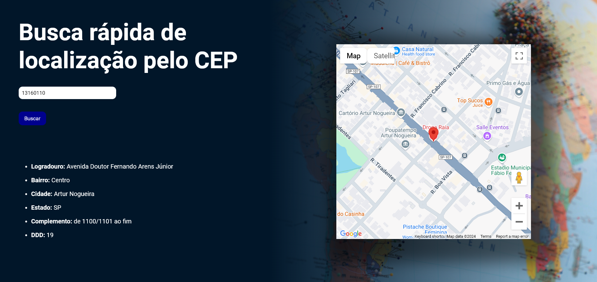

# Descrição

Neste projeto, foi integrada a API do Google Maps. Ao inserir um CEP, o mapa exibe a localização correspondente, acompanhada de informações adicionais, como logradouro, bairro, cidade e outros dados relevantes.

